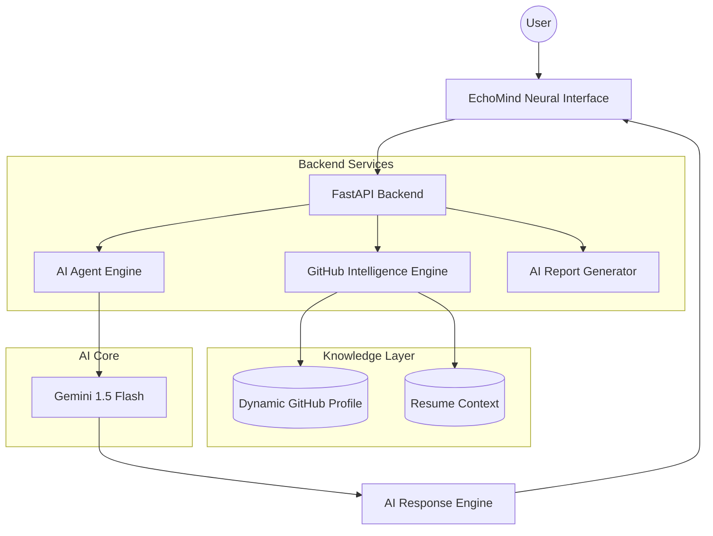

# 🧠 EchoMind Architecture

This document describes the architecture and internal workflow of **EchoMind**, an AI-powered Digital Twin platform designed to transform a developer portfolio into a real-time conversational experience.

---

# 🌌 System Overview

EchoMind uses a **Hybrid RAG (Retrieval-Augmented Generation)** architecture that combines:

- Static developer context
- Dynamic GitHub intelligence
- AI-driven reasoning
- Interactive voice-enabled UI

The platform enables recruiters, collaborators, and developers to interact directly with an AI representation trained on real project data, engineering knowledge, and technical context.

---

# ⚙️ High-Level Architecture

